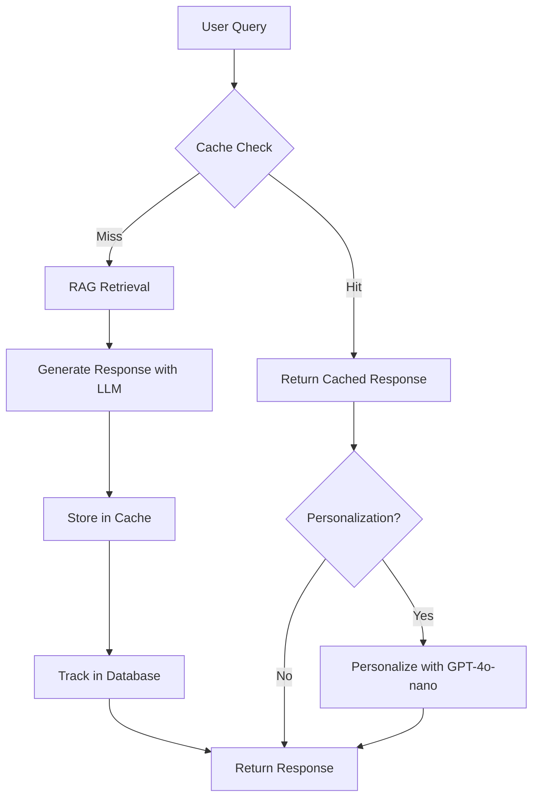

# LMS Tutor AI - API Documentation

## Table of Contents
1. [Overview](#overview)
2. [Architecture](#architecture)
3. [Core Services Workflow](#core-services-workflow)
4. [API Endpoints](#api-endpoints)
   - [Chat APIs](#chat-apis)
   - [WebSocket APIs](#websocket-apis)
   - [Document Management](#document-management)
   - [User Management](#user-management)
   - [Course Management](#course-management)
   - [Chatroom Management](#chatroom-management)
   - [User Context Management](#user-context-management)
   - [Health Check](#health-check)
   - [Database Seeder](#database-seeder)
5. [Authentication](#authentication)
6. [Error Handling](#error-handling)
7. [Integration Examples](#integration-examples)

## Overview

LMS Tutor AI is a RAG (Retrieval-Augmented Generation) based chatbot system with semantic caching capabilities, designed for Learning Management Systems. It provides intelligent Q&A functionality with personalized responses based on course materials and user learning preferences.

### Key Features
- **RAG-based Knowledge Retrieval**: Retrieves relevant context from course documents
- **Semantic Caching**: Intelligent caching system to reduce latency and API costs
- **Personalization**: Adapts responses based on user learning profiles
- **Real-time Streaming**: WebSocket support for streaming responses
- **Multi-model Support**: Uses GPT-4o-mini for comprehensive responses and GPT-4o-nano for personalization

### Base URL
```
http://localhost:8000
```

### Technology Stack
- **Backend**: FastAPI (Python)
- **Vector Database**: Redis with RedisVL
- **LLM**: OpenAI GPT-4o-mini, GPT-4o-nano
- **Database**: PostgreSQL
- **Embeddings**: OpenAI text-embedding-3-small

## Architecture

### System Architecture
```
┌─────────────────┐     ┌──────────────────┐     ┌──────────────────┐
│                 │     │                  │     │                  │
│   Frontend      │────▶│    FastAPI       │────▶│   PostgreSQL     │
│   Application   │     │    Backend       │     │   Database       │
│                 │     │                  │     │                  │
└─────────────────┘     └──────────────────┘     └──────────────────┘
                               │
                               ├──────────────────────┐
                               ▼                      ▼
                    ┌──────────────────┐   ┌──────────────────┐
                    │  Redis Cache      │   │  Redis Knowledge │
                    │  (Port 6380)      │   │  Base (Port 6379)│
                    └──────────────────┘   └──────────────────┘
                               │
                               ▼
                    ┌──────────────────┐
                    │   OpenAI API     │
                    │  - GPT-4o-mini   │
                    │  - Embeddings    │
                    └──────────────────┘
```

### Database Schema
```
Users ──────┬──▶ Chatrooms ◀─── Courses
            │         │              │
            ├──▶ Messages            ├──▶ Documents
            │         │              │
            ├──▶ Responses           ├──▶ CourseKnowledgeBase
            │                        │
            └──▶ UserContexts ◀──────┘
```

## Core Services Workflow

### Chat Request Flow


### Key Components

1. **SimpleChatService**: Main orchestration layer
   - Manages cache checking
   - Coordinates RAG retrieval
   - Handles response personalization

2. **UnifiedRAGService**: Document retrieval and response generation
   - Vector similarity search
   - Context-aware response generation
   - Knowledge base management

3. **CustomCacheService**: Semantic caching system
   - Vector-based similarity matching
   - TTL-based cache expiration
   - User-specific cache entries

## API Endpoints

### Chat APIs

#### 1. Chat Ask (Non-Streaming)
```http
POST /chat/ask
```

**Description**: Generate a chat response with RAG and caching support

**Request Body**:
```json
{
  "query": "What is machine learning?",
  "user_id": "user123",
  "course_id": "cs101",
  "chatroom_id": "room456",
  "use_personalization": false
}
```

**Response**:
```json
{
  "response": "Machine learning is a subset of artificial intelligence...",
  "sources": [
    {
      "content": "Document excerpt...",
      "metadata": {
        "material_id": "doc123",
        "course_id": "cs101",
        "filename": "ml_basics.pdf",
        "score": 0.95
      }
    }
  ],
  "cached": false,
  "token_usage": {
    "input_tokens": 150,
    "output_tokens": 200,
    "total_tokens": 350
  },
  "latency_ms": 1250.5,
  "timestamp": "2024-01-15T10:30:00",
  "metadata": {
    "source": "rag",
    "source_type": "knowledge_base",
    "response_type": "rag_response",
    "model_used": "gpt-4o-mini",
    "personalized": false,
    "course_id": "cs101",
    "cost_usd": 0.0035
  },
  "response_source": "rag"
}
```

**Response Types**:
- `cache_raw`: Direct cache hit without personalization
- `cache_personalized`: Cache hit with personalization applied
- `rag`: Fresh response from knowledge base
- `error`: Error occurred

#### 2. Clear Cache
```http
DELETE /chat/cache
```

**Query Parameters**:
- `user_id` (optional): Clear cache for specific user

**Response**:
```json
{
  "message": "Successfully cleared cache for user123",
  "cleared_entries": 15
}
```

### WebSocket APIs

#### 1. Streaming Chat
```websocket
ws://localhost:8000/ws/stream
```

**Connection Parameters**:
- `user_id`: User identifier (required)
- `course_id`: Course identifier (required)
- `chatroom_id`: Chatroom identifier (optional)

**Example Connection**:
```javascript
const ws = new WebSocket('ws://localhost:8000/ws/stream?user_id=user123&course_id=cs101');
```

**Message Format (Send)**:
```json
{
  "type": "chat_request",
  "query": "Explain neural networks",
  "use_personalization": true,
  "chatroom_id": "room456"
}
```

**Message Types (Receive)**:
```json
// Connection established
{
  "type": "connection",
  "status": "connected",
  "user_id": "user123",
  "course_id": "cs101",
  "timestamp": 1705320600.5,
  "config": {
    "model_comprehensive": "gpt-4o-mini",
    "model_personalized": "gpt-4o-nano",
    "rag_threshold": 0.3,
    "streaming": true
  }
}

// Chat started
{
  "type": "chat_started",
  "query": "Explain neural networks",
  "timestamp": 1705320601.0,
  "metadata": {
    "course_id": "cs101",
    "chatroom_id": "room456",
    "use_personalization": true
  }
}

// Content chunk
{
  "type": "chat_chunk",
  "chunk": "Neural networks are ",
  "chunk_index": 1,
  "timestamp": 1705320601.5
}

// Chat completed
{
  "type": "chat_complete",
  "response": "Complete response text...",
  "chunks_count": 15,
  "response_length": 500,
  "latency_ms": 1500.0,
  "timestamp": 1705320602.5,
  "done": true
}

// Error
{
  "type": "error",
  "error": "Error message",
  "timestamp": 1705320600.5
}
```

#### 2. WebSocket Status
```http
GET /ws/status
```

**Response**:
```json
{
  "websocket_status": "active",
  "active_connections": 5,
  "connected_users": ["user123", "user456"],
  "endpoint": "/ws/stream",
  "supported_features": {
    "streaming": true,
    "database_integration": true,
    "cache_integration": true,
    "token_tracking": true,
    "bidirectional": true,
    "personalization": true
  }
}
```

### Document Management

#### 1. Upload Document
```http
POST /documents/upload
```

**Request**: Multipart/form-data
- `file`: PDF or TXT file (required)
- `course_id`: Course identifier (optional)

**Response**:
```json
{
  "message": "Successfully uploaded and processed document.pdf",
  "filename": "document.pdf",
  "material_id": "a1b2c3d4e5f6",
  "course_id": "cs101",
  "total_chunks": 25,
  "file_type": ".pdf",
  "preprocessed": true,
  "total_chars": 15000,
  "knowledge_base_linked": true
}
```

#### 2. Get Course Documents
```http
GET /documents/course/{course_id}
```

**Parameters**:
- `limit`: Maximum documents to return (default: 50, max: 5000)

**Response**:
```json
{
  "course_id": "cs101",
  "documents": [
    {
      "text": "Document content...",
      "material_id": "abc123",
      "course_id": "cs101",
      "filename": "lecture1.pdf",
      "page": "1"
    }
  ],
  "total_documents": 25,
  "total_chars": 125000,
  "limit": 50
}
```

#### 3. Get Material Documents
```http
GET /documents/material/{material_id}
```

#### 4. Delete Course Documents
```http
DELETE /documents/course/{course_id}
```

#### 5. Delete Material
```http
DELETE /documents/material/{material_id}
```

### User Management

#### 1. List Users
```http
GET /users/
```

**Query Parameters**:
- `role`: Filter by role (admin, instructor, student)
- `search`: Search by username or email
- `page`: Page number (default: 1)
- `limit`: Items per page (default: 20, max: 100)

**Response**:
```json
{
  "users": [
    {
      "user_id": "user123",
      "username": "john_doe",
      "email": "john@example.com",
      "role": "student",
      "created_at": "2024-01-15T10:00:00"
    }
  ],
  "total_count": 150,
  "page": 1,
  "limit": 20
}
```

#### 2. Get User by ID
```http
GET /users/{user_id}
```

#### 3. Create User
```http
POST /users/
```

**Request Body**:
```json
{
  "username": "john_doe",
  "email": "john@example.com",
  "password_hash": "$2b$12$...",
  "role": "student"
}
```

### Course Management

#### 1. List Courses
```http
GET /courses/
```

**Query Parameters**:
- `instructor_id`: Filter by instructor
- `page`: Page number (default: 1)
- `limit`: Items per page (default: 20, max: 100)

**Response**:
```json
{
  "courses": [
    {
      "course_id": "cs101",
      "title": "Introduction to Computer Science",
      "description": "Fundamental concepts...",
      "instructor_id": "instructor1",
      "instructor_name": "Dr. Smith",
      "instructor_email": "smith@university.edu",
      "created_at": "2024-01-01T10:00:00",
      "updated_at": "2024-01-15T10:00:00"
    }
  ],
  "total_count": 50,
  "page": 1,
  "limit": 20
}
```

#### 2. Get Course by ID
```http
GET /courses/{course_id}
```

**Response includes course statistics**:
```json
{
  "course_id": "cs101",
  "title": "Introduction to Computer Science",
  "description": "Fundamental concepts...",
  "instructor_id": "instructor1",
  "instructor_info": {
    "username": "dr_smith",
    "email": "smith@university.edu"
  },
  "stats": {
    "documents_count": 15,
    "total_file_size": 52428800,
    "processed_documents": 14,
    "pending_documents": 1,
    "chatrooms_count": 25,
    "user_contexts_count": 30
  },
  "created_at": "2024-01-01T10:00:00",
  "updated_at": "2024-01-15T10:00:00"
}
```

#### 3. Create Course
```http
POST /courses/
```

**Request Body**:
```json
{
  "title": "Machine Learning Fundamentals",
  "description": "Introduction to ML concepts",
  "instructor_id": "instructor1"
}
```

#### 4. Update Course
```http
PUT /courses/{course_id}
```

#### 5. Delete Course
```http
DELETE /courses/{course_id}
```

#### 6. Get Course Statistics
```http
GET /courses/{course_id}/stats
```

#### 7. Get Popular Courses
```http
GET /courses/popular/top
```

**Query Parameters**:
- `limit`: Number of courses (default: 10, max: 50)

### Chatroom Management

#### 1. Create Chatroom
```http
POST /chatrooms/
```

**Request Body**:
```json
{
  "room_name": "CS101 Discussion",
  "description": "Main discussion room for CS101",
  "user_id": "user123",
  "course_id": "cs101",
  "max_messages": 1000
}
```

**Response**:
```json
{
  "chatroom_id": "room456",
  "user_id": "user123",
  "course_id": "cs101",
  "room_name": "CS101 Discussion",
  "description": "Main discussion room for CS101",
  "is_active": true,
  "max_messages": 1000,
  "created_at": "2024-01-15T10:00:00",
  "updated_at": "2024-01-15T10:00:00"
}
```

#### 2. Get Chatroom by ID
```http
GET /chatrooms/{chatroom_id}
```

#### 3. Update Chatroom
```http
PUT /chatrooms/{chatroom_id}
```

**Request Body**:
```json
{
  "room_name": "Updated Room Name",
  "description": "Updated description",
  "is_active": true,
  "max_messages": 2000
}
```

#### 4. Delete Chatroom
```http
DELETE /chatrooms/{chatroom_id}
```

#### 5. List Chatrooms
```http
GET /chatrooms/
```

**Query Parameters**:
- `user_id`: Filter by user (required)
- `page`: Page number (default: 1)
- `limit`: Items per page (default: 20, max: 100)

#### 6. Get User-Course Chatroom
```http
GET /chatrooms/user/{user_id}/course/{course_id}
```

#### 7. Reactivate Chatroom
```http
POST /chatrooms/{chatroom_id}/reactivate
```

### User Context Management

#### 1. List User Contexts
```http
GET /user-contexts/
```

**Query Parameters**:
- `user_id`: Filter by user
- `course_id`: Filter by course
- `is_template`: Filter templates only
- `limit`: Number of results (default: 100, max: 1000)
- `offset`: Pagination offset (default: 0)

#### 2. Get User Context by ID
```http
GET /user-contexts/{context_id}
```

#### 3. Get User-Course Context
```http
GET /user-contexts/user/{user_id}/course/{course_id}
```

#### 4. Create User Context
```http
POST /user-contexts/
```

**Request Body**:
```json
{
  "user_id": "user123",
  "course_id": "cs101",
  "user_context": "Preferensi: Step-by-step explanations\nGoals: Understand fundamentals\nLearning style: Visual learner\nInformasi tambahan: Prefer examples",
  "is_template": false,
  "template_name": null
}
```

#### 5. Create from Template
```http
POST /user-contexts/from-template
```

**Query Parameters**:
- `user_id`: User identifier
- `course_id`: Course identifier
- `template_id`: Template to use

#### 6. Update User Context
```http
PUT /user-contexts/{context_id}
```

**Request Body**:
```json
{
  "user_context": "Updated learning preferences...",
  "template_name": null
}
```

#### 7. Delete User Context
```http
DELETE /user-contexts/{context_id}
```

#### 8. Get Templates
```http
GET /user-contexts/templates
```

**Response**:
```json
[
  {
    "template_id": "template_beginner",
    "template_name": "Pemula Dasar",
    "user_context": "Preferensi: Saya lebih suka penjelasan yang sederhana...",
    "description": "Template untuk pemula yang butuh penjelasan sederhana",
    "category": "beginner"
  },
  {
    "template_id": "template_intermediate",
    "template_name": "Menengah Praktis",
    "user_context": "Preferensi: Saya suka penjelasan yang seimbang...",
    "description": "Template untuk learner tingkat menengah",
    "category": "intermediate"
  },
  {
    "template_id": "template_advanced",
    "template_name": "Lanjutan Eksploratif",
    "user_context": "Preferensi: Saya suka diskusi mendalam...",
    "description": "Template untuk advanced learners",
    "category": "advanced"
  }
]
```

#### 9. Get User Context Statistics
```http
GET /user-contexts/stats/overview
```

### Health Check

#### 1. Health Status
```http
GET /health/
```

**Response**:
```json
{
  "status": "healthy",
  "services": {
    "database": "connected",
    "redis_cache": "connected",
    "redis_knowledge": "connected",
    "openai": "available"
  }
}
```

### Database Seeder

#### 1. Seed All Tables
```http
POST /seed/all
```

**Response**:
```json
{
  "success": true,
  "message": "Database seeded successfully",
  "summary": {
    "users": 4,
    "courses": 4,
    "documents": 2,
    "contents": 2,
    "user_contexts": 4,
    "chatrooms": 4,
    "knowledge_base_entries": 8
  }
}
```

#### 2. Get Seeding Status
```http
GET /seed/status
```

#### 3. Clear All Data
```http
DELETE /seed/all
```

## Authentication

Currently, the API does not implement authentication middleware. For production use, you should implement:

1. **JWT Authentication**: Add Bearer token authentication
2. **API Keys**: For service-to-service communication
3. **Rate Limiting**: Prevent abuse

Example implementation:
```python
# Add to request headers
headers = {
    "Authorization": "Bearer YOUR_JWT_TOKEN"
}
```

## Error Handling

### Error Response Format
```json
{
  "error": "ERROR_CODE",
  "message": "Human-readable error message",
  "details": {
    "field": "Additional error context"
  }
}
```

### Common Error Codes
- `400`: Bad Request - Invalid input parameters
- `404`: Not Found - Resource doesn't exist
- `409`: Conflict - Resource already exists
- `500`: Internal Server Error
- `503`: Service Unavailable

### Custom Exception Types
- `TutorServiceException`: Base exception for all service errors
- `CacheException`: Cache-related errors
- `RAGException`: RAG service errors
- `LLMException`: LLM API errors
- `EmbeddingException`: Embedding generation errors
- `RedisException`: Redis connection errors
- `PDFExtractionError`: Document processing errors
- `FileProcessingError`: File handling errors

## Integration Examples

### 1. React Integration

#### Basic Chat Component
```jsx
import React, { useState, useEffect } from 'react';
import axios from 'axios';

const ChatComponent = ({ userId, courseId }) => {
  const [message, setMessage] = useState('');
  const [response, setResponse] = useState(null);
  const [loading, setLoading] = useState(false);
  const [chatroomId, setChatroomId] = useState(null);

  // Create chatroom on mount
  useEffect(() => {
    const createChatroom = async () => {
      try {
        const res = await axios.post('http://localhost:8000/chatrooms/', {
          user_id: userId,
          course_id: courseId,
          room_name: `Chat for ${courseId}`,
          description: 'Auto-created chatroom'
        });
        setChatroomId(res.data.chatroom_id);
      } catch (error) {
        console.error('Failed to create chatroom:', error);
      }
    };
    createChatroom();
  }, [userId, courseId]);

  const sendMessage = async () => {
    setLoading(true);
    try {
      const res = await axios.post('http://localhost:8000/chat/ask', {
        query: message,
        user_id: userId,
        course_id: courseId,
        chatroom_id: chatroomId,
        use_personalization: true
      });
      setResponse(res.data);
    } catch (error) {
      console.error('Chat error:', error);
    } finally {
      setLoading(false);
    }
  };

  return (
    <div>
      <input
        type="text"
        value={message}
        onChange={(e) => setMessage(e.target.value)}
        placeholder="Ask a question..."
      />
      <button onClick={sendMessage} disabled={loading}>
        {loading ? 'Thinking...' : 'Send'}
      </button>
      {response && (
        <div>
          <h3>Response:</h3>
          <p>{response.response}</p>
          <small>
            Source: {response.response_source} | 
            Cached: {response.cached ? 'Yes' : 'No'} |
            Latency: {response.latency_ms}ms
          </small>
        </div>
      )}
    </div>
  );
};
```

#### WebSocket Streaming Component
```jsx
import React, { useState, useEffect, useRef } from 'react';

const StreamingChat = ({ userId, courseId, chatroomId }) => {
  const [message, setMessage] = useState('');
  const [responses, setResponses] = useState([]);
  const [isConnected, setIsConnected] = useState(false);
  const [isStreaming, setIsStreaming] = useState(false);
  const ws = useRef(null);

  useEffect(() => {
    // Connect to WebSocket
    const wsUrl = `ws://localhost:8000/ws/stream?user_id=${userId}&course_id=${courseId}`;
    ws.current = new WebSocket(wsUrl);

    ws.current.onopen = () => {
      setIsConnected(true);
      console.log('WebSocket connected');
    };

    ws.current.onmessage = (event) => {
      const data = JSON.parse(event.data);
      handleWebSocketMessage(data);
    };

    ws.current.onerror = (error) => {
      console.error('WebSocket error:', error);
    };

    ws.current.onclose = () => {
      setIsConnected(false);
      console.log('WebSocket disconnected');
    };

    return () => {
      ws.current?.close();
    };
  }, [userId, courseId]);

  const handleWebSocketMessage = (data) => {
    switch (data.type) {
      case 'chat_started':
        setIsStreaming(true);
        setResponses(prev => [...prev, { type: 'assistant', content: '', isStreaming: true }]);
        break;
      
      case 'chat_chunk':
        setResponses(prev => {
          const newResponses = [...prev];
          const lastResponse = newResponses[newResponses.length - 1];
          if (lastResponse && lastResponse.isStreaming) {
            lastResponse.content += data.chunk;
          }
          return newResponses;
        });
        break;
      
      case 'chat_complete':
        setIsStreaming(false);
        setResponses(prev => {
          const newResponses = [...prev];
          const lastResponse = newResponses[newResponses.length - 1];
          if (lastResponse) {
            lastResponse.isStreaming = false;
            lastResponse.latency = data.latency_ms;
          }
          return newResponses;
        });
        break;
      
      case 'error':
        setIsStreaming(false);
        console.error('Chat error:', data.error);
        break;
    }
  };

  const sendMessage = () => {
    if (!isConnected || !message.trim() || isStreaming) return;

    // Add user message to responses
    setResponses(prev => [...prev, { type: 'user', content: message }]);

    // Send to WebSocket
    ws.current.send(JSON.stringify({
      type: 'chat_request',
      query: message,
      use_personalization: true,
      chatroom_id: chatroomId
    }));

    setMessage('');
  };

  return (
    <div>
      <div className="chat-messages">
        {responses.map((resp, idx) => (
          <div key={idx} className={`message ${resp.type}`}>
            <div className="content">
              {resp.content}
              {resp.isStreaming && <span className="cursor">▋</span>}
            </div>
            {resp.latency && (
              <small>Response time: {resp.latency}ms</small>
            )}
          </div>
        ))}
      </div>
      
      <div className="chat-input">
        <input
          type="text"
          value={message}
          onChange={(e) => setMessage(e.target.value)}
          onKeyPress={(e) => e.key === 'Enter' && sendMessage()}
          placeholder="Type your message..."
          disabled={!isConnected || isStreaming}
        />
        <button onClick={sendMessage} disabled={!isConnected || isStreaming}>
          {isStreaming ? 'Generating...' : 'Send'}
        </button>
      </div>
      
      <div className="status">
        Status: {isConnected ? '🟢 Connected' : '🔴 Disconnected'}
      </div>
    </div>
  );
};
```

### 2. Document Upload Component
```jsx
import React, { useState } from 'react';
import axios from 'axios';

const DocumentUpload = ({ courseId }) => {
  const [file, setFile] = useState(null);
  const [uploading, setUploading] = useState(false);
  const [result, setResult] = useState(null);

  const handleUpload = async () => {
    if (!file) return;

    setUploading(true);
    const formData = new FormData();
    formData.append('file', file);
    
    try {
      const res = await axios.post(
        `http://localhost:8000/documents/upload?course_id=${courseId}`,
        formData,
        {
          headers: {
            'Content-Type': 'multipart/form-data'
          }
        }
      );
      setResult(res.data);
    } catch (error) {
      console.error('Upload failed:', error);
    } finally {
      setUploading(false);
    }
  };

  return (
    <div>
      <input
        type="file"
        accept=".pdf,.txt"
        onChange={(e) => setFile(e.target.files[0])}
      />
      <button onClick={handleUpload} disabled={uploading}>
        {uploading ? 'Uploading...' : 'Upload Document'}
      </button>
      
      {result && (
        <div>
          <h4>Upload Successful!</h4>
          <p>Material ID: {result.material_id}</p>
          <p>Chunks created: {result.total_chunks}</p>
          <p>Total characters: {result.total_chars}</p>
        </div>
      )}
    </div>
  );
};
```

### 3. User Context Management
```jsx
import React, { useState, useEffect } from 'react';
import axios from 'axios';

const UserContextManager = ({ userId, courseId }) => {
  const [templates, setTemplates] = useState([]);
  const [selectedTemplate, setSelectedTemplate] = useState('');
  const [customContext, setCustomContext] = useState({
    preferences: '',
    goals: '',
    learningStyle: '',
    additional: ''
  });

  useEffect(() => {
    // Load templates
    const loadTemplates = async () => {
      try {
        const res = await axios.get('http://localhost:8000/user-contexts/templates');
        setTemplates(res.data);
      } catch (error) {
        console.error('Failed to load templates:', error);
      }
    };
    loadTemplates();
  }, []);

  const applyTemplate = (templateId) => {
    const template = templates.find(t => t.template_id === templateId);
    if (template) {
      // Parse template context
      const lines = template.user_context.split('\n');
      const parsed = {};
      lines.forEach(line => {
        if (line.startsWith('Preferensi:')) 
          parsed.preferences = line.substring('Preferensi:'.length).trim();
        if (line.startsWith('Goals:')) 
          parsed.goals = line.substring('Goals:'.length).trim();
        if (line.startsWith('Learning style:')) 
          parsed.learningStyle = line.substring('Learning style:'.length).trim();
        if (line.startsWith('Informasi tambahan:')) 
          parsed.additional = line.substring('Informasi tambahan:'.length).trim();
      });
      setCustomContext(parsed);
    }
  };

  const saveContext = async () => {
    const contextText = `Preferensi: ${customContext.preferences}
Goals: ${customContext.goals}
Learning style: ${customContext.learningStyle}
Informasi tambahan: ${customContext.additional}`;

    try {
      await axios.post('http://localhost:8000/user-contexts/', {
        user_id: userId,
        course_id: courseId,
        user_context: contextText
      });
      alert('Learning profile saved successfully!');
    } catch (error) {
      console.error('Failed to save context:', error);
    }
  };

  return (
    <div>
      <h3>Learning Profile Setup</h3>
      
      <div>
        <label>Use Template:</label>
        <select onChange={(e) => applyTemplate(e.target.value)}>
          <option value="">Custom Profile</option>
          {templates.map(t => (
            <option key={t.template_id} value={t.template_id}>
              {t.template_name} - {t.description}
            </option>
          ))}
        </select>
      </div>

      <div>
        <label>Learning Preferences:</label>
        <textarea
          value={customContext.preferences}
          onChange={(e) => setCustomContext({...customContext, preferences: e.target.value})}
          placeholder="e.g., I prefer step-by-step explanations with examples"
        />
      </div>

      <div>
        <label>Learning Goals:</label>
        <textarea
          value={customContext.goals}
          onChange={(e) => setCustomContext({...customContext, goals: e.target.value})}
          placeholder="e.g., Understand fundamentals and pass exams"
        />
      </div>

      <div>
        <label>Learning Style:</label>
        <textarea
          value={customContext.learningStyle}
          onChange={(e) => setCustomContext({...customContext, learningStyle: e.target.value})}
          placeholder="e.g., Visual learner, prefer demos over theory"
        />
      </div>

      <div>
        <label>Additional Information:</label>
        <textarea
          value={customContext.additional}
          onChange={(e) => setCustomContext({...customContext, additional: e.target.value})}
          placeholder="e.g., Please use simple analogies"
        />
      </div>

      <button onClick={saveContext}>Save Learning Profile</button>
    </div>
  );
};
```

### 4. TypeScript Types

```typescript
// types/api.ts

export interface ChatRequest {
  query: string;
  user_id?: string;
  course_id?: string;
  chatroom_id?: string;
  use_personalization?: boolean;
}

export interface ChatResponse {
  response: string;
  sources: Source[];
  cached: boolean;
  token_usage: TokenUsage;
  latency_ms: number;
  timestamp: string;
  metadata: ResponseMetadata;
  response_source: ResponseSource;
}

export interface Source {
  content: string;
  metadata: {
    material_id: string;
    course_id: string;
    filename: string;
    score: number;
  };
}

export interface TokenUsage {
  input_tokens: number;
  output_tokens: number;
  total_tokens: number;
}

export interface ResponseMetadata {
  source: string;
  source_type: 'knowledge_base' | 'redis_cache';
  response_type: 'cache_hit_raw' | 'cache_hit_personalized' | 'rag_response';
  model_used: string;
  personalized: boolean;
  course_id?: string;
  cost_usd: number;
}

export type ResponseSource = 'cache_raw' | 'cache_personalized' | 'rag' | 'error';

export interface WebSocketMessage {
  type: 'connection' | 'chat_started' | 'chat_chunk' | 'chat_complete' | 'error';
  [key: string]: any;
}

export interface User {
  user_id: string;
  username: string;
  email: string;
  role: 'admin' | 'instructor' | 'student';
  created_at: string;
}

export interface Course {
  course_id: string;
  title: string;
  description?: string;
  instructor_id: string;
  instructor_name?: string;
  instructor_email?: string;
  created_at: string;
  updated_at: string;
  stats?: CourseStats;
}

export interface CourseStats {
  documents_count: number;
  total_file_size: number;
  processed_documents: number;
  pending_documents: number;
  chatrooms_count: number;
  user_contexts_count: number;
}

export interface Chatroom {
  chatroom_id: string;
  user_id: string;
  course_id: string;
  room_name: string;
  description?: string;
  is_active: boolean;
  max_messages: number;
  created_at: string;
  updated_at: string;
  message_count?: number;
}

export interface UserContext {
  context_id: string;
  user_id: string;
  course_id: string;
  user_context: string;
  is_template?: boolean;
  template_name?: string;
  created_at: string;
  updated_at: string;
  last_used_at: string;
}

export interface UserContextTemplate {
  template_id: string;
  template_name: string;
  user_context: string;
  description: string;
  category: 'beginner' | 'intermediate' | 'advanced' | 'general';
}
```

## Best Practices

### 1. Error Handling
- Always implement retry logic for network failures
- Handle WebSocket reconnection gracefully
- Provide user-friendly error messages

### 2. Performance Optimization
- Use WebSocket streaming for better UX
- Implement client-side caching for static data
- Batch document uploads when possible

### 3. User Experience
- Show loading states during API calls
- Display response sources and cache status
- Allow users to customize their learning profiles

### 4. Security
- Sanitize user inputs before sending
- Validate file types and sizes client-side
- Implement rate limiting on client

### 5. Monitoring
- Track API response times
- Monitor token usage and costs
- Log errors for debugging

## Rate Limits

Default rate limits (when enabled):
- 100 requests per 60 seconds per IP
- WebSocket: 1 connection per user
- Document upload: 10MB max file size
- Batch operations: 100 items max

## CORS Configuration

Default CORS settings allow:
- Origins: http://localhost:3000, http://localhost:8000, http://127.0.0.1:3000, http://127.0.0.1:8000
- Methods: GET, POST, PUT, DELETE, OPTIONS
- Headers: All headers allowed
- Credentials: Allowed

For production, update CORS settings in environment variables.

## Environment Variables

Required environment variables:
```env
# OpenAI Configuration
OPENAI_API_KEY=your-openai-api-key
OPENAI_MODEL_COMPREHENSIVE=gpt-4o-mini
OPENAI_MODEL_PERSONALIZED=gpt-4.1-nano
OPENAI_EMBEDDING_MODEL=text-embedding-3-small

# PostgreSQL Configuration
POSTGRES_DB=postgres
POSTGRES_USER=postgres
POSTGRES_PASSWORD=postgres
POSTGRES_HOST=localhost
POSTGRES_PORT=5432

# Redis Configuration
REDIS_KNOWLEDGE_URL=redis://localhost:6379
REDIS_CACHE_URL=redis://localhost:6380

# API Configuration
API_HOST=0.0.0.0
API_PORT=8000
SECRET_KEY=your-secret-key

# Cache Configuration
CACHE_THRESHOLD=0.3
CACHE_TTL=3600

# RAG Configuration
RAG_TOP_K=5
RAG_CHUNK_SIZE=1000
RAG_CHUNK_OVERLAP=200
RAG_DISTANCE_THRESHOLD=0.3
```

## Support

For issues or questions:
- Check API logs: `logs/api.log`
- Review health endpoint: `GET /health/`
- Monitor WebSocket status: `GET /ws/status`

---

**Version**: 1.0.0  
**Last Updated**: November 2024  
**API Base URL**: http://localhost:8000  
**Documentation URL**: http://localhost:8000/docs
